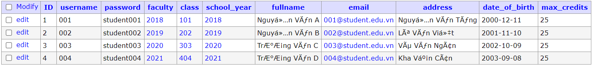

# B1 chạy docker compose
+ `docker-compose up`
# B2 try cập 
+ `http://localhost:8000/`
+ thông tin đăng nhập: 

# Vào xem db chỉnh sử dữ liệu:
+ `http://localhost:9081/` thông tin server `db`, username `admin`, password `mysql12345` db `dkhp` 

### DB
+ check chatset `SELECT SCHEMA_NAME 'database', default_character_set_name 'charset', DEFAULT_COLLATION_NAME 'collation' FROM information_schema.SCHEMATA;`